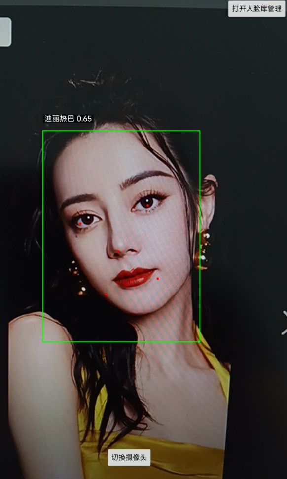

# MobileFaceNet

本项目参考了[ArcFace](https://arxiv.org/abs/1801.07698)的损失函数结合MobileNet，意在开发一个模型较小，但识别准确率较高且推理速度快的一种人脸识别项目，并做了一定的改进, 如模型使用了SE模块，使用了效果更好的AAM损失函数，使用动态调整损失函数的Margin。该项目训练数据使用emore数据集，一共有85742个人，共5822653张图片，使用lfw-align-128数据集作为测试数据。


# 环境
 - Pytorch 2.11.0
 - Python 3.11

# 安装依赖
 1. 安装Pytorch。
```
pip3 install torch torchvision --index-url https://download.pytorch.org/whl/cu130
```

 2. 安装其他依赖。
```
pip3 install -r requirements.txt
```


# 数据集准备
本项目提供了标注文件，存放在`dataset`目录下，解压即可。另外需要下载下面这两个数据集，下载完解压到`dataset`目录下。
 - emore数据集[百度网盘](https://pan.baidu.com/s/1eXohwNBHbbKXh5KHyItVhQ)
 - lfw-align-128下载地址：[百度网盘](https://pan.baidu.com/s/1tFEX0yjUq3srop378Z1WMA) 提取码：b2ec

然后执行下面命令，制作成训练数据的二进制文件，加快训练时读取速度。
```shell
python create_dataset.py
```

# 训练

执行`train.py`即可，更多训练参数请查看代码。
```shell
python train.py
```

训练输出如下：
```
2026-05-04 11:13:18.832867 Train epoch 0/50, batch: 0/45490, loss: 18.79444, acc: 0.0, lr: 0.00001, eta: 25 days, 14:37:51
2026-05-04 11:13:32.611387 Train epoch 0/50, batch: 100/45490, loss: 18.63379, acc: 0.0, lr: 0.00001, eta: 5 days, 23:32:17
2026-05-04 11:13:46.402430 Train epoch 0/50, batch: 200/45490, loss: 18.69627, acc: 0.0, lr: 0.00001, eta: 5 days, 23:05:42
2026-05-04 11:14:00.193215 Train epoch 0/50, batch: 300/45490, loss: 18.63806, acc: 0.0, lr: 0.00001, eta: 5 days, 23:58:55
2026-05-04 11:14:13.993782 Train epoch 0/50, batch: 400/45490, loss: 18.68702, acc: 0.0, lr: 0.00001, eta: 5 days, 23:56:50
2026-05-04 11:14:27.790523 Train epoch 0/50, batch: 500/45490, loss: 18.91446, acc: 0.0, lr: 0.00001, eta: 5 days, 23:38:44
2026-05-04 11:14:41.593387 Train epoch 0/50, batch: 600/45490, loss: 18.51042, acc: 0.0, lr: 0.00001, eta: 5 days, 23:59:49
2026-05-04 11:14:55.379825 Train epoch 0/50, batch: 700/45490, loss: 18.45938, acc: 0.0, lr: 0.00001, eta: 5 days, 23:52:34
2026-05-04 11:15:09.188305 Train epoch 0/50, batch: 800/45490, loss: 18.62561, acc: 0.0, lr: 0.00001, eta: 5 days, 23:56:10
2026-05-04 11:15:22.993479 Train epoch 0/50, batch: 900/45490, loss: 18.69341, acc: 0.0, lr: 0.00001, eta: 5 days, 23:41:08
```

# 评估

执行`eval.py`即可，更多训练参数请查看代码。
```shell
python eval.py
```

# 预测

本项目已经不教提供了模预测，模型文件可以直接用于预测。在执行预测之前，先要在face_db目录下存放人脸图片，每张图片只包含一个人脸，并以该人脸的名称命名，这建立一个人脸库。之后的识别都会跟这些图片对比，找出匹配成功的人脸。这里使用的人脸检测是MTCNN模型，这个模型具有速度快，模型小的特点，源码地址：[Pytorch-MTCNN](https://github.com/yeyupiaoling/Pytorch-MTCNN)

如果是通过图片路径预测的，请执行下面命令。
```shell
python infer.py --image_path=dataset/test.jpg --face_db_path=face_db --threshold=0.5
```
日志输出如下：
```
-----------  Configuration Arguments -----------
face_db_path: face_db
image_path: dataset/test.jpg
mobilefacenet_model_path: save_model/mobilefacenet.pth
mtcnn_model_path: save_model/mtcnn
threshold: 0.5
------------------------------------------------
2026-05-07 21:39:58.301 | INFO     | utils.predictor:__init__:24 - 模型加载完成
2026-05-07 21:39:59.101 | INFO     | utils.predictor:update_face_db:30 - 人脸库更新完成
2026-05-07 21:39:59.575 | INFO     | utils.predictor:recognition:133 - 人脸对比结果：迪丽热巴 - 相似度: 0.7469
2026-05-07 21:39:59.575 | INFO     | utils.predictor:recognition:133 - 人脸对比结果：杨幂 - 相似度: 0.5755
识别结果： [{'name': '迪丽热巴', 'prob': 0.7469, 'bbox': [267, 50, 323, 127]}, {'name': '杨幂', 'prob': 0.5755, 'bbox': [159, 58, 214, 133]}]
总识别时间：474ms
```


如果是通过相机预测的，请执行下面命令。
```shell
python infer_camera.py --camera_id=0 --face_db_path=face_db --threshold=0.5
```

# Android部署

- `python3 model_to_android.py` 导出模型为Android可加载的格式，会将模型文件导出到Android项目的`assets`目录下。
- 使用Android Studio打开Android项目，点击运行按钮，即可在设备上运行。

效果图如下：




# C++部署

项目代码和构建说明：
- 项目代码在`cpp/`目录下
- 构建说明和使用说明在[cpp/README.md](cpp/README.md)文件中


# 模型优化记录表

| 优化方式                      | 准确率     |
|---------------------------|---------|
| 上一个版本                     | 0.83017 |
| 优化后                       |         |
| 优化后+SE模块                  | 0.92683 |
| 优化后+SE模块+margin_scheduler |         |
